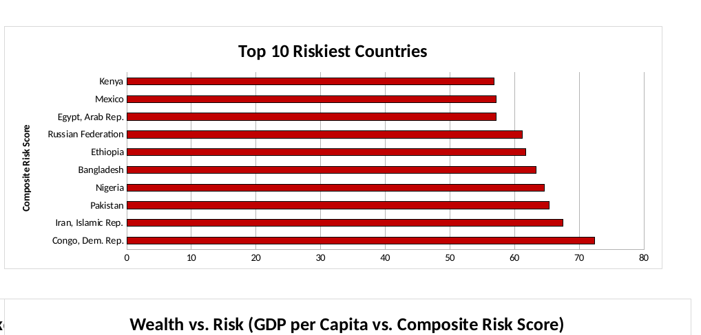
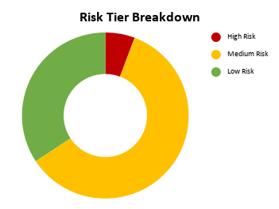
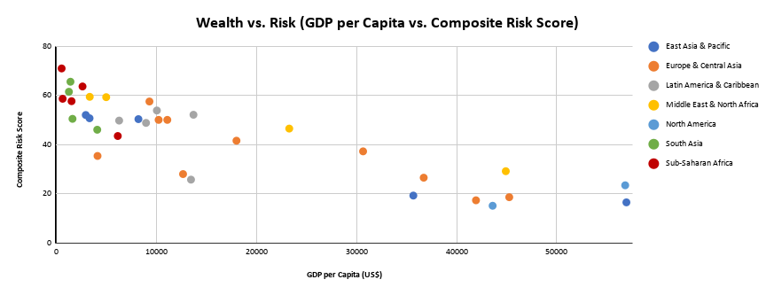
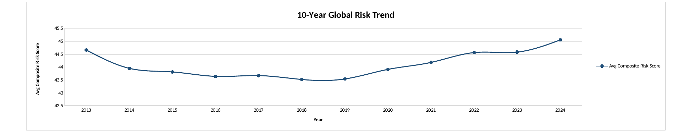
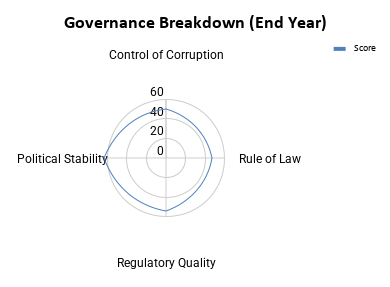

# Sovereign Compliance & Risk Analysis Dashboard

A simple guide to what this project measures, where the numbers come from, and how to read the results.

---

## 1. What this is

An Excel dashboard that scores 35 countries across 7 regions, for 12 years (2013 to 2024), on governance quality. It turns that into a single Composite Risk Score so countries can be ranked and compared.

## 2. Data sources

| Source | What it provides |
|---|---|
| World Bank, Worldwide Governance Indicators (WGI) | 4 governance scores per country per year. Control of Corruption, Rule of Law, Regulatory Quality, Political Stability |
| World Bank, World Development Indicators (WDI) | GDP per capita (current US$) |
| World Bank Country Classification (CLASS.xlsx) | Region and Income Group for each country |

All four scores run from 0 to 100. 100 always means "best," so least corrupt, strongest rule of law, and so on.

## 3. Methodology

**Composite Risk Score**
```
Governance Average   = mean(Corruption, Rule of Law, Regulatory Quality, Political Stability)
Composite Risk Score = 100 - Governance Average
```
So a higher score means higher risk. A country with strong governance across the board ends up with a low risk score.

**Risk Tier**
```
Score above 65        -> High Risk
Score 40 to 65         -> Medium Risk
Score below 40         -> Low Risk
```

Data note: the tier labels already present in the raw cleaned CSV only ever use "Low Risk" and "Medium Risk." No row in the source file is tagged "High Risk," even though scores reach as high as 72.4. That means the source file's own tiering does not actually follow the formula above. The dashboard fixes this by computing tiers itself with the correct formula. So the numbers you see here, like 3 High Risk countries in 2024, are the accurate ones. This is worth mentioning if you are comparing against the raw file directly.

## 4. How the dashboard is organized

- Global Overview tab: the big picture. Filter by region, income group, and year. See KPIs, a full country ranking, the riskiest countries, a tier breakdown, a wealth vs risk scatter chart, and the 10 year trend.
- Country Deep Dive tab: pick one country and see its governance profile, its own trend line, how it compares to regional peers, and a full year by year table.

Both tabs are fully interactive. Every chart and number recalculates when you change a dropdown filter.

## 5. The charts

**Top 10 Riskiest Countries (2024).** Congo, D.R. tops the list, driven mainly by weak corruption control and political instability. Iran and Pakistan follow.



**Risk Tier Breakdown (2024).** Most countries in this sample sit in the medium risk band. Only 3 of 35 are High Risk.



**Wealth vs. Risk.** Richer countries generally score safer, but it is not a straight line. Gulf and resource rich states, shown in yellow and orange, often sit richer but riskier than their GDP alone would suggest. A few upper middle income reformers sit safer than expected.



**10 Year Global Risk Trend.** Average risk fell steadily from 2013 to a low around 2018 to 2019, then has been climbing back up since 2020. By 2024 it is close to where it started.



**Country Deep Dive example, India.** The radar chart shows India's four governance pillars side by side. Rule of Law and Regulatory Quality are its relative strengths. Corruption control is its relative weak point.



## 6. Simple takeaways

- Safest country in 2024: Australia, score 17.7
- Riskiest country in 2024: Congo, Dem. Rep., score 72.4
- Most improved from 2013 to 2024: Saudi Arabia, down 10.8 points
- Most deteriorated from 2013 to 2024: Turkiye, up 9.2 points
- Global average risk score in 2024: 45.1. This is almost identical to 2013, which was 44.7, despite the dip and recovery in between.

## 7. Limitations

These are carried over from the original project scope.

- All four governance pillars are weighted equally. A compliance officer might reasonably weight corruption more heavily.
- WGI scores are perception based. They come from expert surveys, not hard measurements.
- The 35 countries were picked for regional spread, not statistical representativeness. Do not read this as a global average.
- This covers governance risk only. No inflation, debt, or market volatility data is included.
- WGI has a 1 to 2 year publication lag, so "2024" reflects conditions as of roughly late 2023.

## 8. Tools used

World Bank DataBank for the source data. Python and pandas for cleaning. Excel and openpyxl for the dashboard, formulas, and charts.